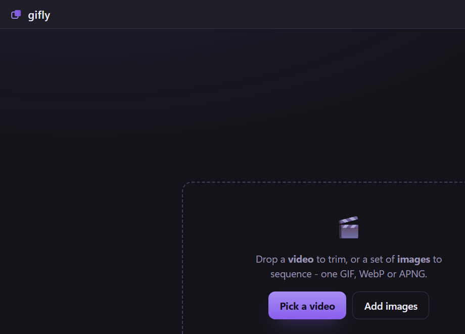

# gifly

**[hoijun-kim.github.io/gifly](https://hoijun-kim.github.io/gifly/)** ·
[Releases](https://github.com/hoijun-kim/gifly/releases)


Drop in a video or a set of images. Trim or reorder, pick a size, aspect,
speed, loop and dither, then export a **GIF, WebP or APNG** - with a live size
estimate and an optional target-size fit - and copy it straight to your
clipboard.

Windows only. No installer, no runtime dependencies, no cgo. gifly does the
timing and options; a bundled [FFmpeg](https://ffmpeg.org) does the encoding.



## Get gifly

Two builds on the [releases](https://github.com/hoijun-kim/gifly/releases) page:

- **`gifly-<version>-win64.zip`** - the small app plus a `ffmpeg/` folder next
  to it. Unzip and run `gifly.exe`; keep the `ffmpeg/` folder beside it.
- **`gifly-<version>-standalone-win64.zip`** - one self-contained `gifly.exe`
  with FFmpeg inside. No folder to keep around; it is large because it carries
  FFmpeg and unpacks it on first run.

The build is not code-signed, so Windows SmartScreen warns on first run:
**More info > Run anyway**. Verify the download against the published
`SHA256SUMS.txt` if you want certainty.

### Using it

One screen. On the left is the preview and the **Make** button; on the right
are the options.

1. **Pick a video** (to trim) or **Add images** (to sequence) - gifly takes
   either.
2. **Timing** - a video's trim range and frame rate, or the images' per-frame
   duration and order.
3. **Format** (GIF / WebP / APNG), **Size** (a width plus a Free / 1:1 / 16:9 /
   9:16 crop), **Playback** (loop, speed, reverse, boomerang), **Quality**
   (colors and dither for GIF, quality for WebP), and **Output** (a Discord /
   Slack / Twitter preset or a target size in MB).
4. **Save** - beside the source or a folder you choose, a name of your own, and
   what to do if the name is taken (number, overwrite or timestamp).
5. **Make** it. The live estimate tells you roughly how big it will be first;
   when it is done, **Copy** puts the file on your clipboard to paste into a
   chat, or **Open folder** reveals it.

### Formats

- **GIF** - universal, 256 colors, selectable dithering (none / bayer / sierra2
  / floyd).
- **WebP** - much smaller, lossy, with a quality slider.
- **APNG** - lossless, full color, largest.

## Build from source

Requires Go 1.26+ and the [Wails v2](https://wails.io) CLI. gifly shells out to
FFmpeg, so point it at one while developing:

```sh
# ffmpeg.exe and ffprobe.exe in this folder (an LGPL build works)
set GIFLY_FFMPEG_DIR=C:\path\to\ffmpeg\bin

wails dev      # run the app
wails build    # build build/bin/gifly.exe (needs an ffmpeg/ folder beside it)
```

Tests: `go test ./...`. The engine's real-FFmpeg tests are behind a build tag -
`go test -tags ffmpeg ./...` with `GIFLY_FFMPEG_DIR` set. Release artifacts are
built by `scripts/package.sh <version>`.

## License

gifly is licensed under the
[PolyForm Noncommercial License 1.0.0](LICENSE).

gifly bundles **FFmpeg**, used unmodified under the **LGPL-3.0**. See
[NOTICE.txt](NOTICE.txt) and
[THIRD-PARTY-LICENSES/ffmpeg-LICENSE.txt](THIRD-PARTY-LICENSES/ffmpeg-LICENSE.txt).
You can replace it with your own FFmpeg via `GIFLY_FFMPEG_DIR` or the `ffmpeg/`
folder.
